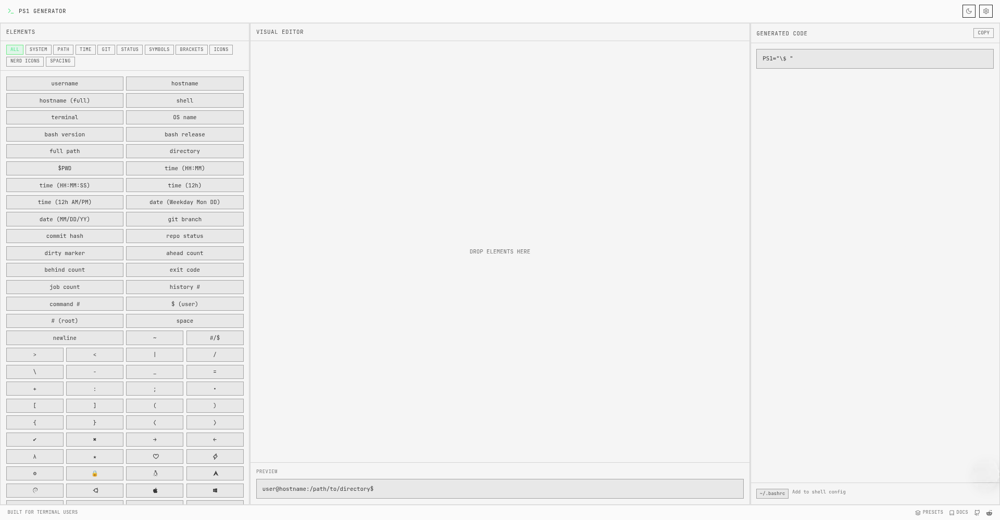
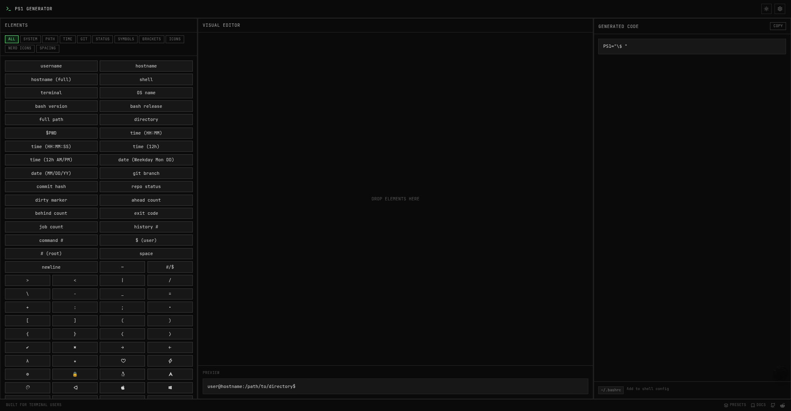

<div align="center">

# Minimalist Prompt Generator

[](https://bashrcgenerator.vercel.app/)

[](https://github.com/shivamksharma/MinimalistPromptGenerator/stargazers)
[](https://opensource.org/licenses/MIT)
[](https://www.typescriptlang.org/)
[](https://reactjs.org/)
[](https://vitejs.dev/)
[](https://tailwindcss.com/)
[](https://vercel.com/)

A fast, animation-free, hyper-minimal drag-and-drop prompt generator for PS1.

</div>


## 🚀 Overview

**Minimalist Prompt Generator** is a sleek and user-friendly tool for creating personalized PS1 shell prompts with ease. Built with a focus on simplicity, it offers a clean and intuitive interface, making it easy to design prompts that elevate your terminal experience while maintaining a minimalist aesthetic.

Inspired by the functionality and simplicity of Bashrc Generator.

## 💡 Why This Tool?

Fast, animation-free, hyper-minimal drag-and-drop prompt generator for PS1. Designed for developers who value speed, simplicity, and a distraction-free experience. No bloat, just pure functionality to craft your perfect terminal prompt.

## ✨ Features

- **Visual Editor**: Drag-and-drop elements to design your prompt.
- **Real-time Preview**: See your prompt changes instantly.
- **Syntax Customization**: Adjust colors, styles, and layout to match your preferences.
- **Export Options**: Save your custom PS1 prompt as text, HTML, or Markdown.
- **Save & Load Configurations**: Easily store and retrieve custom configurations.
- **Help & Documentation**: Quick syntax guide, keyboard shortcuts, and feedback support.

## 🔧 Installation

Clone the repository:

```bash
git clone https://github.com/shivamksharma/MinimalistPromptGenerator.git
```

Navigate into the project folder:

```bash
cd MinimalistPromptGenerator
```

Install dependencies:

```bash
npm install
```

Run the development server:

```bash
npm run dev
```

## 🖼️ Screenshots

<p align="center">
  
  
</p>

<p align="center">
  <sub>Light Mode</sub> &nbsp;&nbsp;&nbsp;&nbsp;&nbsp; <sub>Dark Mode</sub>
</p>

## 📖 Usage

1. Open the app in your browser.
2. Drag elements from the sidebar to the visual editor.
3. Customize each element's color and style.
4. See your prompt changes instantly in the preview.
5. Export or save your configuration.

## 💼 Export Options

- **Plain Text**: Copy the generated prompt code directly.
- **HTML Code Block**: For use in documentation.
- **Markdown Code Block**: Easily share in Markdown files.

## 📚 Help & Documentation

The app provides:
- A syntax guide for PS1 prompt elements and color codes.
- Keyboard shortcuts to enhance your workflow.
- A support link for feedback and bug reporting.

## 🛠️ Contributing

Contributions are welcome! Please open issues or submit pull requests to improve the project.

## 📝 License

This project is licensed under the MIT License. See the [LICENSE](https://github.com/shivamksharma/MinimalistPromptGenerator/blob/main/LICENSE) file for more details.

